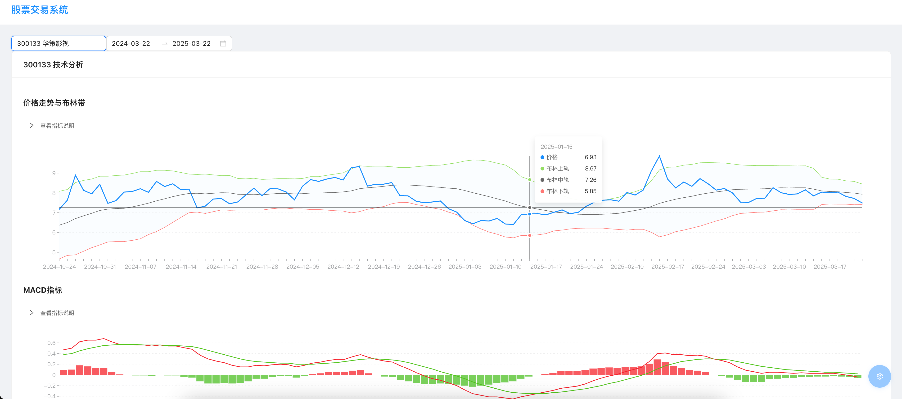
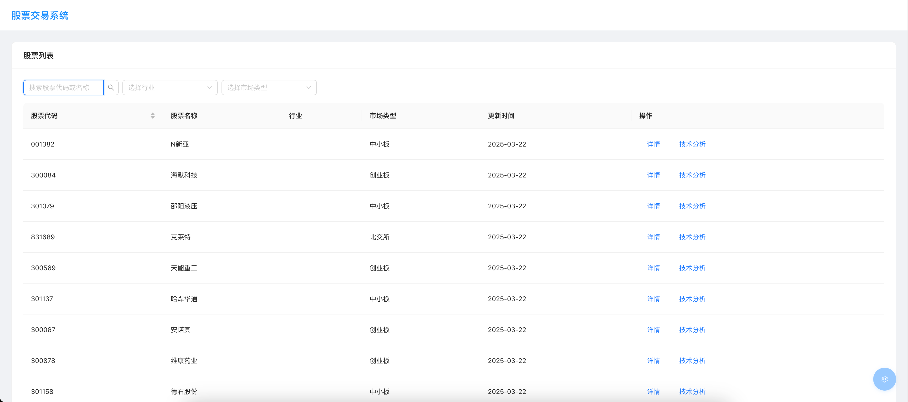
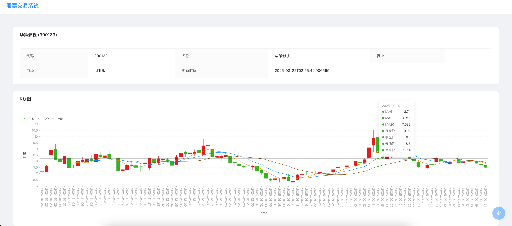

# 股票交易分析系统

📈 一个现代化的股票交易分析系统，基于 FastAPI 和 React 构建，提供实时数据分析、技术指标计算和可视化展示功能。这是一个完全由 AI 辅助开发的开源项目，展示了 AI 时代下的开发新范式。



## 🌟 项目愿景

在 AI 蓬勃发展的新时代，我们希望：

- 🤝 **降低金融技术门槛**
  - 让更多人能够参与量化交易
  - 提供直观易用的分析工具
  - 降低策略开发难度

- 🌈 **开源共建生态**
  - 鼓励社区贡献和创新
  - 共享优质策略和经验
  - 促进知识交流与成长

- 🔬 **探索 AI 开发新范式**
  - 展示 AI 辅助开发的可能性
  - 推动技术创新与实践
  - 分享开发经验与心得

## ✨ 核心特性

- 🔍 **实时数据分析**
  - 支持实时股票数据获取和分析
  - 自动计算常用技术指标（MACD、RSI、布林带等）
  - 智能数据验证和异常处理

- 📊 **专业技术分析**
  - 多维度技术指标展示
  - 交互式图表分析
  - 自定义时间区间分析

- 📱 **现代化界面**
  - 响应式设计，支持多设备访问
  - 直观的数据可视化
  - 用户友好的操作界面

- 💾 **数据管理**
  - 支持数据导出（CSV/Excel）
  - 历史数据回溯
  - 数据完整性校验

## 🔮 未来规划

### 🤖 量化交易策略

- **策略开发框架**
  - 支持 Python/JavaScript 策略编写
  - 内置常用指标和工具函数
  - 提供策略模板和示例
  - 支持实时策略调试
  - AI 辅助策略生成

- **多维度策略分析**
  - 技术指标组合策略
  - 机器学习模型集成
  - 情绪分析和新闻事件驱动
  - 多标的联动交易
  - 大语言模型市场分析

- **智能策略优化**
  - 遗传算法自动优化参数
  - 机器学习模型自适应
  - 动态风险控制
  - 多目标优化支持
  - AI 策略诊断与优化

### 📊 回测系统

- **高性能回测引擎**
  - 支持多级别时间周期
  - T+0/T+1 交易规则
  - 精确的手续费模型
  - 支持并行回测
  - 云原生分布式架构

- **场景模拟**
  - 历史市场情景重现
  - 极端行情测试
  - 随机市场模拟
  - 多市场联动测试
  - AI 生成对抗市场

- **性能分析**
  - 详细的交易记录
  - 策略绩效评估
  - 风险指标分析
  - 归因分析报告
  - AI 辅助策略诊断

### 📱 增强功能

- **智能助手**
  - 策略开发助手
  - 市场分析助手
  - 风险管理助手
  - 自然语言交互
  - 个性化投资建议

- **社区生态**
  - 策略分享与复制
  - 量化社区讨论
  - 策略排行榜
  - 导师系统
  - 知识库建设

### 🔧 技术升级

- **AI 能力**
  - 大语言模型集成
  - 市场预测模型
  - 智能风控系统
  - 自动化运维
  - 持续学习优化

- **数据生态**
  - 多市场数据接入
  - 另类数据分析
  - 实时数据处理
  - 数据质量保证
  - 数据可视化增强

## 🖥 界面展示

### 股票列表


### 股票详情


### 技术分析


## 🛠 技术栈

### 后端
- 🚀 FastAPI - 高性能异步 Web 框架
- 📦 SQLAlchemy - ORM 框架
- 📊 Pandas & NumPy - 数据处理
- 📈 Akshare - 金融数据接口

### 前端
- ⚛️ React - 用户界面框架
- 📝 TypeScript - 类型安全
- 🎨 Ant Design - UI 组件库
- 📊 AntV G2 - 数据可视化

## 🚀 快速开始

### 使用 Docker（推荐）

```bash
# 克隆项目
git clone <repository_url>
cd stock-trading

# 启动服务
docker-compose up --build
```

### 手动安装

<details>
<summary>展开查看详细步骤</summary>

#### 后端设置

```bash
# 1. 创建虚拟环境
cd backend
python -m venv venv
source venv/bin/activate  # Linux/Mac
# 或
.\venv\Scripts\activate  # Windows

# 2. 安装依赖
pip install -r requirements.txt

# 3. 配置环境变量
cp .env.example .env
# 编辑 .env 文件

# 4. 运行服务
uvicorn app.main:app --reload --host 0.0.0.0 --port 8000
```

#### 前端设置

```bash
# 1. 安装依赖
cd frontend
npm install

# 2. 配置环境变量
cp .env.example .env
# 编辑 .env 文件

# 3. 运行开发服务器
npm run dev
```

</details>

## 📚 文档

- [项目架构](docs/architecture.md)
- [API 文档](docs/api.md)
- [开发指南](docs/development.md)
- [数据库设计](docs/database.md)
- [前端文档](docs/frontend.md)
- [Docker 配置](docs/docker-setup.md)

## 🔗 服务地址

服务启动后，可通过以下地址访问：

- 📱 前端应用：http://localhost/
- 🚀 API 文档：http://localhost/docs
- 📊 ReDoc：http://localhost/redoc

## 🤝 参与贡献

我们欢迎所有形式的贡献，无论是：

- 💡 新功能建议
- 🐛 问题报告
- 📝 文档改进
- 🎨 界面优化
- 🔧 代码贡献

详细贡献指南：

1. Fork 本项目
2. 创建特性分支 (`git checkout -b feature/AmazingFeature`)
3. 提交更改 (`git commit -m 'Add some AmazingFeature'`)
4. 推送到分支 (`git push origin feature/AmazingFeature`)
5. 提交 Pull Request

## 📄 开源协议

本项目采用 MIT 协议 - 查看 [LICENSE](LICENSE) 文件了解详细信息。

## 🙏 致谢

- 感谢所有贡献者的付出
- 感谢 AI 技术带来的开发新范式
- 感谢以下开源项目：
  - [FastAPI](https://fastapi.tiangolo.com/)
  - [React](https://reactjs.org/)
  - [Ant Design](https://ant.design/)
  - [AntV G2](https://g2.antv.vision/)
  - [Akshare](https://www.akshare.xyz/)