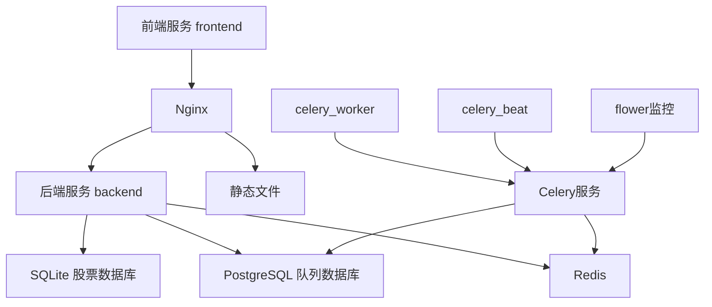

# 项目架构文档

## 服务依赖关系

## 数据库使用说明

### SQLite
- **用途**：存储股票相关数据
- **主要表**：
  - `stock_basics`: 股票基础数据
  - 其他股票相关数据表

### PostgreSQL
- **用途**：Celery 任务队列管理
- **引入时机**：在添加队列功能时引入
- **主要功能**：
  - 存储任务状态
  - 任务调度数据
  - 任务结果持久化

### Redis
- **用途**：Celery broker 和 result backend
- **主要功能**：
  - 消息队列 broker
  - 临时存储任务结果
  - 任务状态追踪

## 服务说明

### 前端服务 (frontend)
- 基于 React 的 Web 界面
- 通过 Nginx 代理访问后端 API

### Nginx
- 反向代理服务器
- 路由请求到后端服务
- 提供静态文件服务

### 后端服务 (backend)
- FastAPI 应用
- 处理 API 请求
- 管理数据库操作
- 集成 Celery 任务

### Celery 服务
- **celery_worker**: 执行异步任务
- **celery_beat**: 定时任务调度器
- **flower**: Celery 监控界面

## 注意事项
1. 股票数据相关的操作必须使用 SQLite 数据库
2. 队列相关的功能使用 PostgreSQL 数据库
3. Redis 仅用于 Celery 的消息队列和结果存储
4. 数据库操作时需要注意使用正确的数据库连接 